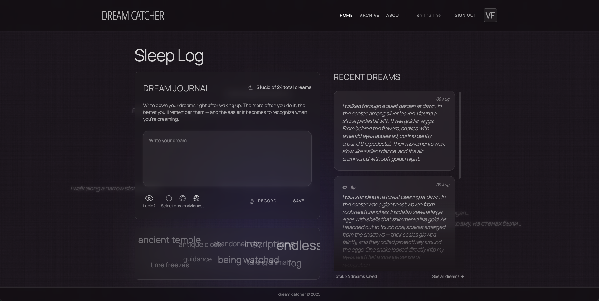
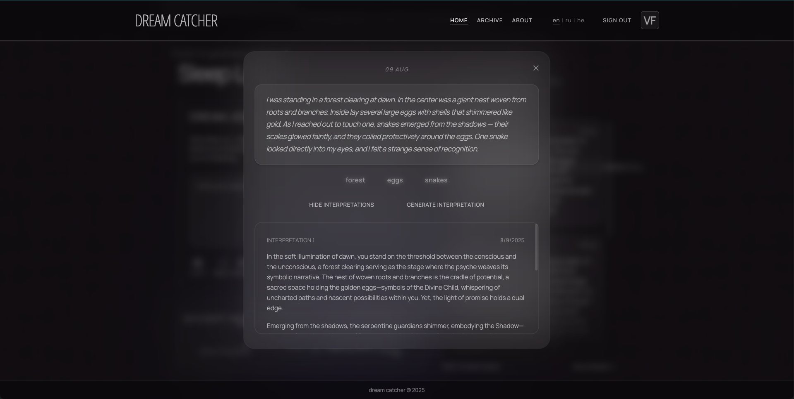

# Dreamcatcher

**Dreamcatcher** is a web application for recording and reflecting on dreams, with optional AI-generated interpretations.  
It was built as both a personal tool and a portfolio project — combining solid frontend engineering, thoughtful UX design, and structured integration of AI features.

The goal is not only to record dreams, but to help users notice recurring motifs, track moments of lucidity, and strengthen self-awareness — making lucid dreaming more attainable through consistent journaling and reflection.

---

## What it does

- Write and save dreams with optional lucid/vividness tagging
- **Floating common motifs** (visible only on the welcome screen for non-registered users), each with a temporary AI-generated Jungian interpretation on hover or click
- For logged-in users, floating elements are short excerpts from their own dreams
- Voice input and transcription using OpenAI Whisper — designed for quick capture of dreams immediately after waking, making it easier to record details before they fade
- Per-dream AI interpretation using GPT-4 with custom archetype structures
- Motif analysis with shared database enrichment
- Archive with search and motif filtering
- Multilingual interface (English, Russian, Hebrew)
- Firebase authentication (Google, planned Email/Password)
- Responsive layout for desktop and mobile

---

### Screenshots

**Home Screen (with floating motifs)**  


**Dream Interpretation Modal**  


---

## About the AI

The AI features are part of the core application architecture — not plug-and-play add-ons.

**GPT-4 is used for two main purposes**:

1. **Dream interpretation** — generating context-aware insights from dream text using custom prompts and archetype structures inspired by Jungian theory, refined and adapted specifically for this app.
2. **Motif analysis** — identifying and classifying key motifs from dreams into archetypal categories, supplementing missing motifs when necessary, and maintaining a shared motif database. Common motifs from this database appear only on the welcome screen for non-registered users, each with a temporary AI-generated Jungian interpretation.

Whisper API is used for accurate voice-to-text transcription.

During development, generative AI tools were also used as assistants for prototyping, refining text, and designing AI prompts — but all architecture, logic, and UI implementation were coded manually.

---

## Tech Stack

- **Framework**: React + Vite
- **State Management**: Redux Toolkit
- **Styling**: TailwindCSS + custom theming
- **Routing**: React Router (with protected routes)
- **Internationalization**: react-i18next
- **Backend/Auth**: Firebase (Auth — Google, planned Email/Password + password reset; Firestore)
- **AI APIs**: OpenAI GPT-4 + Whisper
- **Deployment**: Vercel

---

## Live Project

You can explore the live version here:  
[https://www.dreamcatcherlog.app/](https://www.dreamcatcherlog.app/)

---

## Demo Video

🎥 Recorded demo (2.5 min): [Watch on YouTube](https://youtu.be/77Ad7wEgHjI)

This demo shows the full flow:
- Guest view → shared motifs (before sign-up)
- Sign-up / sign-in
- Adding a dream (voice or text)
- AI interpretation
- Personal motifs and history

> Note: Recorded on desktop. Mobile layout may differ (e.g. iPhone SE). Some features require microphone/dictation permissions.

---

## GitHub Repository

The source code is available on GitHub:  
[https://github.com/AnnaFilin/DreamCatcher](https://github.com/AnnaFilin/DreamCatcher)

---

## Local Setup (optional)

To run locally:

```bash
npm install
npm run dev
```

You will need your own Firebase and OpenAI API credentials for AI features and authentication.

---

## Future Plans

Planned features and improvements:

- **Dream frequency graph** — visualize the number of dreams recorded over time since starting to use the app.
- **Sleep time tracking** — record hours slept for each dream to explore correlations with dream clarity and frequency.
- **Personal motif dashboard** — display motifs most frequently appearing in a user’s dreams.
- **Global motif trends** — show motifs most common across all users while keeping entries private.
- **Shared motifs page for registered users** — make the current public motif display (now only visible on the welcome screen) accessible to logged-in users via a dedicated page, including AI-generated Jungian interpretations for each motif.
- **Mobile app version** — transform Dreamcatcher into a full-featured mobile application for iOS and Android.
- **User notifications for reality checks** — optional reminders and other tools throughout the day to encourage reality checks and awareness practices, customizable per user.
- **Full multilingual support for motifs and interpretations** — expand language coverage beyond the interface so that motifs and AI-generated interpretations are also available in the user’s selected language, not just in English.
- **Lucid dreaming resources hub** — create a dedicated section with information, research links, and practical techniques related to lucid dreaming, along with the shared motif database.
- **Email & password sign-in** — add traditional auth alongside Google.
- **Password reset & email verification** — support resetting passwords (sendPasswordResetEmail) and optional email verification for new accounts.
- **Improved responsive design** — polish mobile/tablet layouts, especially for modals and controls.
- **Refined motif analysis** — improve semantic similarity checks to avoid duplicates that differ only slightly in wording.
- **UI/UX enhancements for modal windows** — more consistent spacing, typography, and interaction behavior.
- **Code refactoring** — clean up and optimize components, extract reusable parts, remove redundant logic, and improve file structure.
- **Backend proxy migration** — move all OpenAI API calls to serverless functions (Vercel) to hide API keys and improve security.
- **Performance optimization** — lazy load components where possible, reduce bundle size, and optimize rendering of large dream archives.
- **Extended testing** — add automated tests for key logic (motif detection, AI interpretation saving, authentication flows).

---

## Author

Designed, coded, and maintained by [Anna Filin](https://www.linkedin.com/in/anna-filin-39228662/), a frontend developer with 5+ years of experience Vue, React, SwiftUI.  
In addition to building all UI, state management, and integrations from scratch, I work with generative AI tools to speed up prototyping, refine text content, and design AI prompts for application features — ensuring all outputs are reviewed, adapted, and integrated manually.
